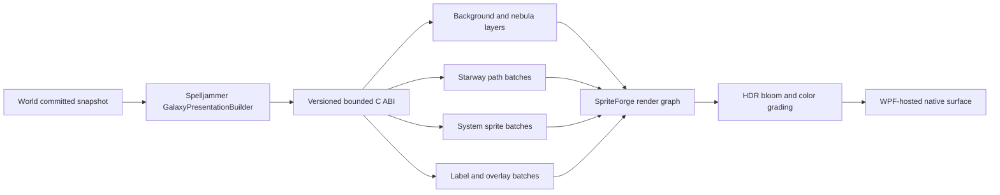

# SpriteForge Strategic Galaxy Renderer Roadmap v2

## 1. Purpose

This document defines the engine capabilities, implementation phases, public
contracts, and acceptance criteria required for SpriteForge to provide a
high-quality strategic galaxy map for Spelljammer. The target is a layered
2.5D map with smooth zooming, luminous stars, curved starways, nebulae,
territory borders, labels, and clear interaction feedback. The goal is not to
copy the art, interface, or visual identity of any existing game.

This is a forward-looking implementation roadmap. It does not claim that every
item described here already exists. Every phase must leave SpriteForge and
Spelljammer independently buildable and preserve the boundary between
authoritative simulation and presentation state.

## 2. Recommended Direction

The first version should be a high-resolution 2.5D strategic map rather than an
expansion of SpriteForge into a complete 3D or PBR engine. Perspective cameras,
3D meshes, orbital bodies, and volumetric nebulae would substantially change
the current sprite-centered renderer architecture, but they are not required
to produce a high-quality top-down galaxy map.

The target rendering pipeline is:



## 3. Existing Baseline

SpriteForge already provides the following reusable capabilities:

- a Windows D3D12 renderer with a fixed logical target;
- the `Renderer2D` frame and scene lifecycle;
- `Camera2D`, coordinate conversion, culling, and stable ordering;
- GPU-instanced sprite batching;
- bindless texture and indirect drawing plans;
- nearest and linear texture sampling;
- typed generational resource handles;
- premultiplied-alpha, additive, and opaque blending;
- SDF fonts, Unicode shaping, and text layout;
- bounded 2D point and directional lighting;
- fixed-step CPU particle simulation and presentation extraction; and
- data-planning foundations for advanced VFX, offscreen composition,
  distortion, and GPU particles.

The main gaps affecting the galaxy map are:

- Spelljammer still draws the galaxy map through WPF `DrawingContext`;
- the managed renderer C ABI primarily exposes textures and complete sprite
  presentation, without complete batch contracts for paths, picking, lighting,
  text, and post-processing;
- the render graph remains a planned design rather than the active D3D12 frame
  path;
- the D3D12 logical target is centered on fixed-resolution pixel art and does
  not yet provide a drawable-resolution smooth strategic-map profile;
- runtime mipmap generation, complete offscreen composition, HDR, bloom, tone
  mapping, and device recovery are unfinished; and
- no general GPU 2D path, scalar-field, contour, or map-label decluttering
  system exists.

## 4. Responsibility Boundary

### SpriteForge owns

- cameras, viewports, and world-to-screen and screen-to-world conversion;
- texture, sprite, path, text, mask, and render-target resources;
- batching, culling, visual LOD mechanisms, and stable composition order;
- path tessellation, antialiasing, dashes, flow animation, and glow masks;
- generic picking primitives and stable presentation pick IDs;
- the render graph, HDR, bloom, tone mapping, color grading, and distortion;
- font shaping, glyph atlases, and the label collision solver;
- particles, lights, parallax, and visual animation;
- GPU capability reporting, capacity, overflow behavior, and telemetry; and
- the versioned C ABI used by managed hosts.

### Spelljammer owns

- `GalaxyTopology`, `GalaxyKnowledgeState`, and `GalaxyDynamicState`;
- `VoyageNavigationState` and voyage commands;
- which systems, starways, hazards, and faction information the player may see;
- the gameplay meaning, color rules, and selection state of systems and
  starways;
- strategic aggregation rules, such as which systems form a cluster at a
  distant zoom level;
- localized text, content IDs, art assets, and visual themes; and
- construction of an immutable presentation snapshot from the committed
  `World`.

The renderer must not read or retain the authoritative `World`, nor may fog,
masks, or animation decide what information the player actually knows.
Spelljammer must filter the presentation snapshot first. Visual fog of war is
a presentation effect, not an information-security boundary.

## 5. Roadmap Overview

| Phase | Deliverable | Dependencies | Exit condition |
| --- | --- | --- | --- |
| 0 | Contracts, profiles, and benchmark scene | Existing renderer | Boundaries, capacities, coordinates, and measurement methods are fixed |
| 1 | Smooth strategic-map scene profile | Phase 0 | High-resolution smooth pan and zoom render correctly |
| 2 | Managed renderer ABI v2 | Phase 1 | C# can present a frame through a small number of bounded batch calls |
| 3 | GPU 2D path renderer | Phases 1-2 | 4,096 curved starways support layering, glow, and animation |
| 4 | Camera interaction and picking | Phase 3 | Nodes, starways, and regions support stable hover and selection |
| 5 | Executable render graph | Phases 1-3 | Offscreen passes and resource transitions execute on D3D12 |
| 6 | HDR, bloom, and color pipeline | Phase 5 | Stars and starways glow without reducing UI clarity |
| 7 | Scalar fields, nebulae, and region borders | Phases 5-6 | Fog, hazards, and faction regions support partial updates |
| 8 | Map labels and visual LOD | Phases 2, 4, and 5 | Labels avoid overlap and flicker while responding to zoom |
| 9 | Particle, lighting, and parallax polish | Phases 5-8 | Star dust and visual animation do not affect authoritative simulation |
| 10 | Spelljammer vertical integration | Phases 2-9 | Galaxy Generator uses a native GPU surface |
| 11 | Performance, recovery, diagnostics, and backends | All earlier phases | Benchmarks, regressions, device recovery, and capability fallbacks are complete |

## 6. Phase 0 — Fix Contracts and Establish a Benchmark

### Work

- Define `PixelPerfect2D` and `SmoothStrategic2D` as explicit, mutually
  exclusive scene profiles.
- Preserve the current pixel-art defaults. A galaxy map must explicitly select
  the smooth profile.
- Fix the origins, axes, and conversion rules for world space, logical space,
  drawable pixels, texture space, and UI space.
- Define renderer owner-thread, resource-lifetime, frame-borrowing, and fence
  contracts.
- Define hard limits and observable overflow behavior for every submission
  type.
- Create `StrategicMapSample` using synthetic data with:
  - 1,024 system nodes;
  - 4,096 starways;
  - 10,000 background stars;
  - 2,000 visible-label candidates;
  - 10,000 presentation-only particles; and
  - at least four zoom buckets.
- Add a fixed camera path and canonical screenshots so every later phase can
  compare against the same input.

### Implementation

Add an independent example and fixture to SpriteForge rather than introducing
Galaxy types into the engine. Scene data must contain only generic sprite,
path, label, field, and pick records. Measurements must record the GPU,
resolution, build configuration, median, P95, P99, draw calls, upload bytes,
and transient memory.

### Exit criteria

- Public contracts document units, ranges, ownership, and thread affinity.
- The reference scene produces the same normalized plan in headless plan tests.
- The GPU screenshot fixture has an explicit tolerance and reviewable diff.
- Every capacity overflow preserves a stable prefix and reports rejected
  counts.
- No Spelljammer gameplay type enters SpriteForge.

## 7. Phase 1 — Smooth Strategic-Map Scene Profile

### Public capability

Add explicit output and sampling policies to scenes, for example:

```cpp
enum class SceneRasterProfile : std::uint8_t
{
    PixelPerfect2D,
    SmoothStrategic2D,
};

enum class SceneTargetSizeMode : std::uint8_t
{
    FixedLogical,
    MatchDrawable,
    ExplicitPixels,
};

struct Scene2DDesc
{
    Camera2D camera{};
    SceneRasterProfile rasterProfile{SceneRasterProfile::PixelPerfect2D};
    SceneTargetSizeMode targetSizeMode{SceneTargetSizeMode::FixedLogical};
    RendererUInt2 explicitTargetSize{};
    RendererFloat4 clearColor{};
};
```

Names may be refined during implementation, but the opt-in smooth profile must
remain explicit and must not change existing pixel-perfect output.

### Implementation

- Create either a fixed-logical or drawable-sized target in the D3D12 backend,
  according to the scene profile.
- Permit fractional camera zoom, linear sampling, and subpixel positions in the
  smooth profile.
- Add texture mip chains for zoomed rendering. Prefer offline mipmap generation;
  add runtime generation only after a concrete dynamic-texture use case exists.
- Continue building camera matrices in the API-neutral renderer. Backends only
  absorb clip-space differences.
- Recreate targets transactionally on resize. Retire the old resource only
  after the new target has been created successfully.
- Preserve `SkipFrame` for minimized or zero-sized drawables without advancing
  resource fences incorrectly.
- Compose UI through a separate scene or after post-processing so text does not
  become blurred by bloom.

### Exit criteria

- Existing pixel-perfect canonical fixtures remain byte-identical.
- Continuous zoom in a smooth scene has no visible stepping, atlas bleeding,
  or target stretching.
- Resize, DPI changes, minimize, and restore have coverage.
- Target-allocation failure leaves the previous usable state intact.

## 8. Phase 2 — Managed Renderer ABI v2

### Design principles

Keep the existing `SpriteForge_RenderSprites` entry point compatible. Add a
versioned ABI without issuing one P/Invoke call per system or starway each
frame.

The ABI should provide:

- capability and ABI-version queries;
- renderer, scene, texture, font or layout, and post-process profile handles;
- `BeginFrame`, `BeginScene`, typed batch submission, `EndScene`, `EndFrame`,
  and `Present`;
- copied or call-scoped borrowed arrays;
- required, written, and rejected counts for each batch type;
- resize, device-lost, out-of-resource, and skipped-frame statuses; and
- a copied snapshot containing complete frame telemetry.

### Implementation

- Add a separate renderer interop header carrying an explicit ABI version.
- Keep all GPU objects behind opaque native contexts. C# retains only
  fixed-width handles.
- Use fixed-width integers, explicit padding, and compile-time size assertions
  in C structures.
- Verify the size of every managed mirror structure in a C# static initializer.
- Borrow batch arrays only for the duration of the call. If the renderer needs
  them later, copy them into a bounded frame arena first.
- Catch all C++ exceptions and translate them to `Status_t`; no exception may
  cross the C ABI.
- Keep the API owner thread aligned with the WPF dispatcher owner thread.
- Let the game own an `HwndHost` or equivalent native child surface. SpriteForge
  must not depend on WPF assemblies.

### Exit criteria

- The number of P/Invoke calls per frame does not grow with the object count.
- Stale, cross-context, and zero handles return explicit errors.
- Native code retains no managed pointer.
- Existing sprite-only consumers continue to work.
- ABI layout, lifetime, capacity, and error paths have native and managed
  contract coverage.

## 9. Phase 3 — GPU 2D Path Renderer

### Public capability

Create generic `Path2D` and `PathBatch2D` contracts supporting at least:

- line strips and cubic Bézier segments;
- world-space or screen-space width;
- round or bevel joins and butt or round caps;
- premultiplied-alpha and additive blending;
- solid, dashed, gradient, and animated-flow styles;
- base stroke, main stroke, selection halo, and emissive mask;
- clipping, layer, order, and stable presentation ID; and
- conservative bounds and camera culling.

### Implementation

- In the first implementation, flatten Bézier curves into segments on the CPU
  according to a screen-space tolerance, then produce triangle strips with an
  antialiasing fringe.
- Cache tessellation by immutable path revision, style revision, and zoom
  bucket. Camera translation must not trigger retessellation.
- Rebuild screen-width paths only when the zoom bucket changes. World-width
  paths may reuse geometry.
- Calculate dash phase, flow offset, hover pulse, and emissive strength from
  presentation time in the shader without modifying path geometry.
- Write geometry into fence-safe dynamic vertex and index rings. Promote static
  topology into persistent GPU buffers where beneficial.
- Sort by layer, order, and stable ID before batching consecutive compatible
  pipeline and texture work. Material optimization must not break transparent
  ordering.
- Bound adaptive subdivision, vertex counts, and cache memory explicitly.

The first implementation should not depend on D3D12 tessellation shaders,
geometry shaders, or mesh shaders. Doing so would increase consistency costs
for Metal and lower-tier hardware without being necessary at this scale.

### Exit criteria

- Line width follows its declared world-space or screen-space behavior during
  continuous zoom.
- Curve joins, caps, dashes, and glow contain no obvious cracks.
- The 4,096 canonical paths do not produce per-path draw calls.
- Tessellation overflow is observable and does not corrupt accepted paths.
- The same input, zoom bucket, and renderer version produce the same normalized
  geometry plan.

## 10. Phase 4 — Camera Interaction and Picking

### Public capability

- `WorldToScreen`, `ScreenToWorld`, and drawable-to-viewport mapping;
- smooth pan, cursor-centered zoom, and an optional presentation-only camera
  tween;
- world bounds, minimum and maximum zoom, and overscroll policy;
- circle, axis-aligned box, sprite bounds, stroked path, and field-region pick
  shapes;
- stable 64-bit presentation pick IDs; and
- hover, click, drag-threshold, and nearest-hit queries.

### Implementation

- Start with a CPU coarse spatial index followed by exact tests, avoiding the
  synchronization cost of GPU ID-buffer readback.
- Accept copied immutable proxy batches in a generic pick scene backed by a
  bounded quadtree or equivalent structure. The pick scene knows nothing about
  systems or starways.
- Perform exact path tests using the shortest pointer distance to flattened
  segments, including screen-space interaction padding.
- Break ties by visual layer, order, distance, and stable pick ID. Never depend
  on hash-map enumeration.
- Keep camera tweening, hover pulses, and inertial panning in presentation
  state. Spelljammer must validate a returned selection before it becomes a
  gameplay command.
- Add an asynchronous GPU ID buffer only if profiling shows that CPU picking is
  insufficient.

### Exit criteria

- Picking remains aligned after resize, DPI changes, letterboxing, and
  fractional zoom.
- Overlapping objects resolve to the same target for the same query.
- Objects filtered out by Spelljammer have no pick proxy.
- Hover queries over 1,024 nodes and 4,096 paths allocate no steady-state heap
  memory.

## 11. Phase 5 — Executable Render Graph

### Initial fixed graph

```text
ReadyUploads
    -> Background
    -> ScalarFields
    -> OpaqueScene
    -> AlphaScene
    -> EmissiveMask
    -> Bloom
    -> Composite
    -> TextAndUI
    -> Present
```

### Implementation

- Implement the resource, pass, read and write declaration, validation,
  topological compilation, barrier planning, and transient-lifetime portions of
  the existing render-graph design.
- Expose engine-owned pass templates in the first version rather than arbitrary
  game shader callbacks.
- Address graph resources through typed handles. A pass callback may access
  only resources declared by that pass.
- Translate neutral states into resource barriers, render passes, and command
  lists in the D3D12 backend. Capability-gate Metal until it is implemented.
- Begin with a safe non-aliasing transient texture pool. Add aliasing only after
  measurement demonstrates meaningful memory pressure.
- Provide offscreen targets and controlled readback for screenshot fixtures.
- If graph compilation fails, submit no partial frame and preserve permanent
  resources from the last completed frame.

### Exit criteria

- Read-before-write, cycles, format or sample mismatches, and illegal lifetimes
  are rejected.
- The same graph description produces a stable normalized pass and barrier
  plan.
- Unsupported passes have either an explicit fallback or a whole-scene
  rejection.
- PIX and RenderDoc markers correspond to neutral pass names.

## 12. Phase 6 — HDR, Bloom, and Color Pipeline

### Implementation

- Store scene color in a linear HDR intermediate target such as
  `RGBA16_FLOAT`.
- Write emissive objects into a separate emissive mask rather than using
  increased ordinary alpha as a substitute for emission.
- Implement bloom through a bounded downsample and upsample pyramid. The first
  version uses a fixed number of levels with configurable threshold, knee,
  intensity, and radius.
- Tone-map HDR scene color into the output color space.
- Support a neutral LUT contract for color grading. The game supplies the
  actual LUT assets.
- Keep vignette, chromatic aberration, and film grain optional and bounded.
  These effects must not make system labels or interaction cues unreadable.
- Compose text and UI after bloom by default. Text that should glow must select
  that material explicitly.
- Document linear versus sRGB and straight versus premultiplied alpha for every
  color contract.

### Exit criteria

- Emission values above 1.0 are not clipped prematurely in intermediate
  targets.
- Disabling bloom skips its passes and resource allocations.
- SDR monitor output is correct. HDR display output may remain a separate later
  phase.
- Canonical images cover dark backgrounds, overlapping translucency, star
  cores, and fine text.

## 13. Phase 7 — Scalar Fields, Nebulae, and Region Borders

### Public capability

Create generic field presentation without introducing faction or fog gameplay
semantics:

- bounded scalar samples or prebuilt R8 or R16 masks;
- world bounds, resolution, dirty rectangles, and revision;
- palette or gradient ramps;
- thresholds, blur, contour levels, and border styles;
- additive nebulae, alpha territory fill, hazard heat maps, and visibility
  masks; and
- an optional animated noise offset.

### Implementation

- Generate a low-resolution field texture on the CPU in the first version,
  then sample and composite it linearly on the GPU.
- Implement blur and distance approximation as fixed render-graph passes. Only
  upload declared dirty rectangles.
- Generate contours on the CPU with marching squares, then submit them through
  the Phase 3 path renderer.
- Keep faction, hazard, and knowledge fields on separate layers and textures so
  each can update independently.
- Use procedural noise only to distort visual sampling. Its seed and
  presentation time must not enter authoritative simulation.
- Retain CPU field generation when compute is unsupported. Add GPU compute only
  after profiling.

### Exit criteria

- An unchanged field revision does not re-upload its texture.
- A local change updates only explicit dirty regions.
- Borders do not visibly jump when changing zoom buckets.
- Disabling or failing the fog layer cannot reveal data that was never placed
  in the presentation snapshot.

## 14. Phase 8 — Map Labels and Visual LOD

### Public capability

Extend the existing `FontSystem` with map-label presentation supporting:

- UTF-8 text, font style, anchor, and preferred offsets;
- minimum and maximum zoom, priority, and collision group;
- compound icon and text labels;
- outline, shadow, background plate, and selection styles;
- stable placement IDs and previous-placement hints; and
- maximum candidate and visible counts with omission diagnostics.

### Implementation

- Let Spelljammer choose candidates and priorities according to gameplay
  semantics. SpriteForge performs only generic placement, collision handling,
  and rendering.
- Sort by stable priority, then test candidate offsets in a fixed order.
- Use zoom buckets and hysteresis to prevent labels from flickering near zoom
  thresholds.
- Cache `FontSystem` layouts and glyph-atlas entries by text, style, locale, and
  revision.
- Copy UTF-8 and style spans through the C ABI. Never retain a managed string
  pointer across frames.
- Let only Spelljammer choose cluster membership and cluster names. The
  renderer must not analyze the galaxy graph.
- Animate label visibility with a short presentation transition while
  respecting the reduced-motion setting.

### Exit criteria

- CJK, Latin, RTL, and mixed-direction labels shape correctly.
- The same candidates, camera bucket, and viewport produce the same placement.
- Labels do not obscure higher-priority interaction targets.
- Large galaxies do not rebuild every text layout or cause an allocation spike
  each frame.

## 15. Phase 9 — Particle, Lighting, and Parallax Polish

### Implementation

- Integrate the existing particle presentation, 2D lighting, and advanced VFX
  into the executable render graph.
- Give the background star field, distant nebulae, galaxy disc, starways, and
  foreground dust independent parallax factors.
- Compose a star from a core sprite, halo sprite, point light, emissive bloom,
  and a bounded number of particles. Do not create a light for every background
  star.
- Use the path shader for starway flow. Use particles only for local bursts or
  drifting objects.
- Drive selection and arrival animations from a presentation clock and provide
  a deterministic-capture clock.
- Keep CPU particles as the correctness baseline. Enable GPU particles only
  after profiling evidence, backend capability support, and pixel-parity
  fixtures exist.
- Degrade excessive VFX by stable priority across distortion, lights,
  particles, and glow radius. Effects must not disappear according to thread
  completion order.

### Exit criteria

- Disabling VFX does not change picking, paths, or `World` results.
- Deterministic capture reproduces the same presentation frame.
- Reduced-motion mode can disable pulses, flow, and camera inertia.
- Particle, light, and distortion overflow have separate telemetry.

## 16. Phase 10 — Spelljammer Vertical Integration

### Spelljammer-side structure

Add a game-owned presentation layer such as:

```text
World committed snapshot
    -> GalaxyPresentationBuilder
        -> visible system records
        -> visible starway records
        -> label candidates
        -> field and overlay revisions
        -> stable presentation pick mapping
    -> SpriteForge managed renderer bridge
    -> native child rendering surface
```

### Implementation

- Let `GalaxyPresentationBuilder` consume immutable `GalaxyState`,
  `VoyageNavigationState`, and local presentation state.
- Include only information currently known to the player and sort all records
  by stable ID.
- Cache topology geometry separately from dynamic styles. Blocking, hovering,
  or selection changes must not rebuild the complete topology.
- Keep campaign setup controls in WPF and replace only the galaxy viewport with
  a SpriteForge native surface. Integrate them through explicit logical and
  physical coordinate mapping.
- Map pointer input through SpriteForge picking, then let Spelljammer resolve
  the presentation ID to a stable game ID and validate the resulting command.
- Replace only the preview viewport during the first integration. Do not
  simultaneously rewrite the main menu or character-creation UI.
- Keep SpriteForge and Spelljammer changes in separate buildable commits and
  record the required ABI version or engine revision.

### Exit criteria

- The same seed and generator version display the same topology.
- WPF and the native surface handle resize, DPI, focus, and pointer capture
  correctly.
- Hover, selection, randomization, regeneration, and back navigation produce no
  stale handles.
- If the renderer is unavailable, the application presents an explicit error
  state rather than silently entering an inconsistent fallback.
- Simulation, saves, and content fingerprints contain no renderer handle or
  camera state.

## 17. Phase 11 — Performance, Recovery, Diagnostics, and Backends

### Performance and capacity

- On documented reference hardware, target a stable 60 FPS at 2560 x 1440 with
  1,024 systems, 4,096 starways, and all intended effects enabled.
- Record budgets for CPU extraction, path tessellation, label placement, ABI
  copying, GPU passes, upload, drawing, presentation, and memory.
- A steady-state frame must not allocate general heap memory, wait for a GPU
  fence, or perform synchronous texture uploads.
- Define quality tiers for lower-end devices by reducing field resolution,
  bloom levels, particles, lights, and background layers without removing
  interaction targets.

### Recovery and tooling

- Complete asynchronous uploads and transactional device-loss recovery.
- Add renderer overlays for bounds, pick proxies, path segments, zoom buckets,
  label collisions, overdraw, batch breaks, field dirty rectangles, and pass
  timings.
- Give render-graph passes and resource handles complete debug names and GPU
  markers.
- Run visual regression on the canonical scene and produce reference, actual,
  and diff artifacts.
- Mark macOS and Metal support only after the same public contract, fallbacks,
  and fixtures pass. Unsupported features must degrade through capability
  queries rather than pretending to succeed.

### Exit criteria

- Benchmark reports identify reference hardware and configuration and include
  median, P95, and P99 results.
- Device loss or failed target recreation leaves no stale public handles.
- Changing quality tiers does not affect `World` state or selection identity.
- D3D12 checked builds report no validation errors.
- Every public capability has a queryable supported or unsupported state.

## 18. Recommended Source Layout

```text
SpriteForge/
├── Engine/Renderer/Public/
│   ├── Scene2DTypes.hpp
│   ├── Path2DTypes.hpp
│   ├── Field2DTypes.hpp
│   ├── Picking2DTypes.hpp
│   └── PostProcessTypes.hpp
├── Engine/Renderer/Path/
├── Engine/Renderer/Fields/
├── Engine/Renderer/Picking/
├── Engine/Renderer/PostProcess/
├── Engine/Renderer/RenderGraph/
├── Engine/Public/
│   └── SpriteForgeRendererInteropV2.h
├── Engine/Interop/
│   └── RendererInteropV2Api.cpp
├── Examples/StrategicMap/
└── Tests/Engine/Renderer/

Spelljammer/
├── Source/Spelljammer.App/Presentation/Galaxy/
│   ├── GalaxyPresentationBuilder.cs
│   ├── GalaxyRenderSnapshot.cs
│   ├── GalaxyRendererHost.cs
│   └── GalaxyPickingMap.cs
└── Source/Spelljammer.App/Interop/
    └── SpriteForgeNative.cs
```

Final file names should follow neighboring module conventions. Do not copy
SpriteForge source into Spelljammer, and do not commit a developer-specific
absolute engine path to Spelljammer.

## 19. First Deliverable Milestone

The first usable version ends after Phase 4 and contains:

- a drawable-resolution smooth scene;
- managed renderer ABI v2;
- a native WPF rendering surface;
- sprite and cubic Bézier path batches;
- basic antialiasing, dashes, flow, and selection halos;
- camera pan and zoom plus system and starway picking; and
- a canonical benchmark containing 1,024 systems and 4,096 starways.

This version does not yet require HDR bloom, scalar fields, complete label
decluttering, or particles. It is nevertheless sufficient to replace the
current WPF line-and-circle preview and establish the correct data flow for
later visual effects.

The second visual milestone ends after Phase 8 and adds the render graph, HDR
bloom, nebulae, faction regions, fog, hazard overlays, and zoom-aware labels.
Phases 9 through 11 then add motion, integration, performance work, and
production hardening.

## 20. Definition of Done for Every Phase

A phase is complete only when all of the following are true:

- public contracts document ownership, units, ranges, thread affinity, and
  capacity;
- the API-neutral plan and D3D12 execution avoid unnecessary backend leakage;
- success, invalid input, stale handle, overflow, rollback, and lifecycle paths
  have source coverage at the narrowest useful level;
- renderer test targets compile, while CI/CD owns execution of unit and GPU
  tests;
- canonical visual changes include a reviewable reference and diff;
- existing pixel-perfect fixtures have no unintended changes;
- README and architecture status documents distinguish implemented work from
  planned work accurately;
- SpriteForge and Spelljammer both build independently against the stated
  engine revision; and
- the final diff contains no generated build output, machine-specific path,
  unauthorized asset, or game-specific rule leaking into SpriteForge.

## 21. Explicitly Deferred Features

The following items are not required by this v2 roadmap:

- perspective 3D cameras;
- depth-buffered 3D meshes;
- skeletal mesh animation;
- physically based rendering;
- volumetric ray-marched nebulae;
- unrestricted runtime shader plug-ins;
- gameplay-authoritative GPU simulation; and
- direct SpriteForge ownership of Galaxy, Faction, Knowledge, or Voyage state.

Create a separate 3D-renderer proposal only after the 2.5D strategic map has
been completed and profiled, and only when a concrete game requirement cannot
be satisfied by composing the existing sprite, path, field, particle, and
parallax capabilities.
